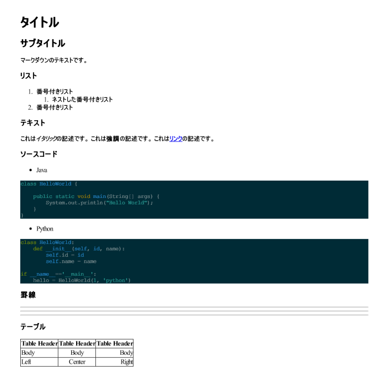

# PythonでマークダウンをPDFに変換する

## やったこと

Pythonで、マークダウンを含むWebページをスクレイピングしてマークダウンに出力し、さらにそのマークダウンをHTMLにしてからPDFに変換しました。（ややこしい）
スクレイピングは`Beautiful Soup`を使用して行いましたが、そこは今回は割愛します。
マークダウン→HTML→PDFに関する情報があまりなかったのでまとめました。

マークダウン→HTMLは`Markdown`を使用し、HTML→PDFは`pdfkit`を利用しました。

## 環境

環境は以下になります。

- Windows10
- wkhtmltopdf
- Python3.8
- Markdown==3.2.1
- pdfkit==0.6.1
- Pygments==2.6.1

Windows環境の場合、`pdfkit`を利用する際に事前に`wkhtmltopdf`をインストールする必要があります。
[こちらのサイト](https://wkhtmltopdf.org/downloads.html)から64bit版をインストールします。
パスを通していいですし、今回するようにPythonのコードで直接実行ファイルのパスを指定してもいいです。

またコードブロックにハイライトを付けるため、`Pygments`を使用します。

フォルダ構成は以下のようにします。

```
   app
    |- file
    |   |- source
    |   |   └─ source.md  ← 元となるマークダウン
    |   └─ pdf            ← PDF出力先
    |- app.py
    └─requirements.txt
```

各ライブラリをインストールします。

```txt:requirements.txt
Markdown==3.2.1
pdfkit==0.6.1
Pygments==2.6.1
```

```console
> pip install -r requirements.txt
```

変換元となるマークダウンは以下のようにします。

```markdown:source.md
# タイトル

## サブタイトル

マークダウンのテキストです。

### リスト

1. 番号付きリスト
    1. ネストした番号付きリスト
1. 番号付きリスト

### テキスト

これは*イタリック*の記述です。
これは**強調**の記述です。
これは[リンク](https://qiita.com/)の記述です。

### ソースコード

- Java

\```java

class HelloWorld {

    public static void main(String[] args) {
        System.out.println("Hello World");
    }
}

\```

- Python

\```python

class HelloWorld:
    def __init__(self, id, name):
        self.id = id
        self.name = name

if __name__=='__main__':
    hello = HelloWorld(1, 'python')

\```

### 罫線

***

---

* * *

### テーブル

| Table Header | Table Header | Table Header |
| :-- | :--: | --: |
| Body | Body | Body |
| Left | Center | Right |


```


## マークダウン→HTML

マークダウンからHTMLに変換するには`Markdown`ライブライを使用します。
拡張機能の`codehilite`を有効にして、`Pygments`でソースコードのハイライトを付けます。

```python:app.py
import markdown
from pygments import highlight
from pygments.formatters import HtmlFormatter

def mark_to_html():
    # マークダウンファイルの読み込み
    f = open('file/source/source.md', mode='r', encoding='UTF-8')
    with f:
        text = f.read()
        # Pygmentsでハイライト用のスタイルシートを作成
        style = HtmlFormatter(style='solarized-dark').get_style_defs('.codehilite')
        # # マークダウン→HTMLの変換を行う
        md = markdown.Markdown(extensions=['extra', 'codehilite'])
        body = md.convert(text)
        # HTML書式に合わせる
        html = '<html lang="ja"><meta charset="utf-8"><body>'
        # Pygmentsで作成したスタイルシートを取り込む
        html += '<style>{}</style>'.format(style)
        # Tableタグに枠線を付けるためにスタイルを追加
        html += '''<style> table,th,td { 
            border-collapse: collapse;
            border:1px solid #333; 
            } </style>'''
        html += body + '</body></html>' 
        return html
```

Markdownには以下のような拡張機能があり、オブジェクを作成する際に拡張機能をリストにして指定することができます。

```python
md = markdown.Markdown(extensions=["拡張機能"])
```

使えそうなものだけ抜粋しています。すべての拡張に関しては以下から。

https://python-markdown.github.io/extensions/#officially-supported-extensions

| 拡張 | 機能 |
| --- | --- |
| extra | 略語要素・リスト・コードブロック・引用・テーブルなど基本的なマークダウン記法をHTMLに変換 |
| admonition | 注意書きを出力することができる |
| codehilite | コードブロックに対してPygmentsで定義されているシンタックスハイライトを付けることができる。Pygmentsが必要。 |
| meta | ファイルのメタ情報を取得することができる |
| nl2br | 1つの改行コードを<br>タグに変換 |
| sane_lists　| 改行含んだリストや指定した数値からの番号付きリストに対応 |
| smarty | `"`,`>`などのHTML特殊文字に対応 |
| toc | 見出しの構成から自動で目次を作成 |
| wikilinks | `[[]]` でのリンク記法に対応 |

これ以外にもサードパーティー製の拡張機能を使用することもできます。

https://github.com/Python-Markdown/markdown/wiki/Third-Party-Extensions

コードのハイライトにしようしている`Pygments`では、適用するスタイル名とクラス名を指定しています。

```python
style = HtmlFormatter(style="スタイル名").get_style_defs("クラス名")
```

適用できるスタイルは`Pygments`のコマンドラインツールから取得することができます。

```console
> pygmentize -L styles
```

クラス名は、`markdown`で`codehilite`を有効にすると`<code class="codehilite">`と出力されるので、`codehilite`に設定します。

## HTML → PDF

HTMLからPDFに変換するために、`pdfkit`というライブラリを使用します。
このライブライリは内部で`wkhtmltopdf`を使用しているため、環境変数にパスを通すか、実行時に実行ファイルのパスを指定する必要があります。

```python:app.py
import pdfkit

def html_to_pdf(html:str):
    """
    html : str HTML
    """
    # 出力ファイルの指定
    outputfile = 'file/pdf/output.pdf'
    # wkhtmltopdfの実行ファイルのパスの指定
    path_wkhtmltopdf = r'C:\Program Files\wkhtmltopdf\bin\wkhtmltopdf.exe'
    config = pdfkit.configuration(wkhtmltopdf=path_wkhtmltopdf)
    # HTML→PDF変換の実行
    pdfkit.from_string(html, outputfile, configuration=config)

```

今回はMTML書式の文字列をPDFファイルに変換していますが、WebサイトをURLを指定してPDFに変換することもできます。その場合は、`from_url`関数を使用します。またHTMLファイルをPDFに変換する場合は、`from_file`を使用します。

## 変換結果

上記関数を実行して変換した結果は以下のようになります。



マークダウンの出力結果をPDFに変換することができています。コードブロックにもハイライトがついています。今回は例には入れませんでしたが、画像の出力も問題なく行うことができます。

## まとめ

Pythonのライブラリの`Markdown`と`pdfkit`を使用して、マークダウンをPDFに変換しました。
テンプレートを作成しておけば、議事録をすぐにPDFに変換できたりするので便利だと思います。
業務効率化のネタに使ってもらえればと思います。